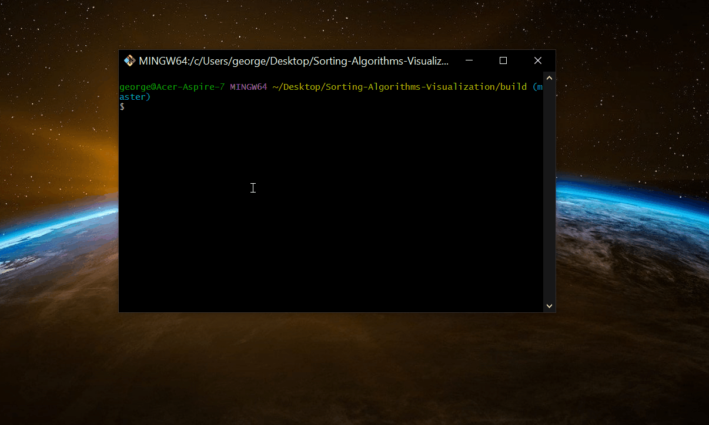

# Sorting-Algorithms-Visualization

Visualization of how 18 sorting algorithms work.

Currently supported algorithms:
* [Bubble sort]()
* [Insertion sort]()
* [Selection sort]()
* [Quick sort]()
* [Merge sort]()
* [Heap sort]()
* [Shell sort]()
* [Gnome sort]()
* [Cocktail sort]()
* [Counting sort]()
* [Pancake sort]()
* [Comb sort]()
* [Tim sort]()
* [Radix sort]()
* [Introsort]() - This is a modified version of introsort, i used Merge sort instead of Heap sort
* [Iterative Quick sort]()
* [Iterative Heap sort]()
* [Binary Insertion sort]()


## Built With

* [SFML](https://www.sfml-dev.org/) - The framework used for rendering
* [CMake](https://cmake.org/) - Build System
* [conan](https://conan.io/) - Open source package manager/dependency manager

## Prerequisites
If you use linux refer to [this](https://github.com/ggiap/Sorting-Algorithms-Visualization/new/master?readme=1#manjaro-linux) paragraph.

### $Windows

#### Python/pip
```
Download and install Python and pip from the official website.
```

#### CMake
```
Donwload and install CMake from the official website.
```

#### conan
After installing pip run the following command:
```
pip install conan
```

## Installing

### Clone the repo
```
git clone https://github.com/ggiap/Sorting-Algorithms-Visualization.git
```

### Create a build folder

```
cd Sorting_Algorithm_Visualization
mkdir build
cd build
```

### Build the executable

***Using MinGW:***
##### Debug build
```
cmake -G "MinGW Makefiles" -DCMAKE_BUILD_TYPE=Debug .. && mingw32-make -j4
```

##### Release build
```
cmake -G "MinGW Makefiles" -DCMAKE_BUILD_TYPE=Release .. && mingw32-make -j4
```

##### Run
```
cd bin && ./Sorting_Algorithm_Visualization
```


***Using MSVC:***
##### Debug build
```
cmake -DCMAKE_BUILD_TYPE=Debug ..
```

##### Release build
```
cmake -DCMAKE_BUILD_TYPE=Release ..
```

##### Run
```
Locate the .sln file and open it
```
```
Select Build -> Build Solution
```
```
Select Debug -> Start without debugging
```


### $Manjaro Linux

#### pip
```
sudo pacman -Syu python-pip
```

#### conan
```
pip install conan
```

#### CMake
```
sudo pacman -Syu cmake
```

## Installing

### Clone the repo
```
git clone https://github.com/ggiap/Sorting-Algorithms-Visualization.git
```

### Create a build folder

```
cd Sorting_Algorithm_Visualization
mkdir build
cd build
```

### Build the executable

##### Debug build
```
cmake -DCMAKE_BUILD_TYPE=Debug .. && make
```

##### Release build
```
cmake -DCMAKE_BUILD_TYPE=Release .. && make
```

##### Run
```
cd bin && ./Sorting_Algorithm_Visualization
```



## Controls

* Select the number of rods
* Enter a delay time in ms if you want the simulation to run slower
* Select an algorithm to start the simulation

## License

This project is licensed under the MIT License - see the [LICENSE.md](https://github.com/ggiap/Sorting-Algorithms-Visualization/blob/master/LICENSE) file for details

